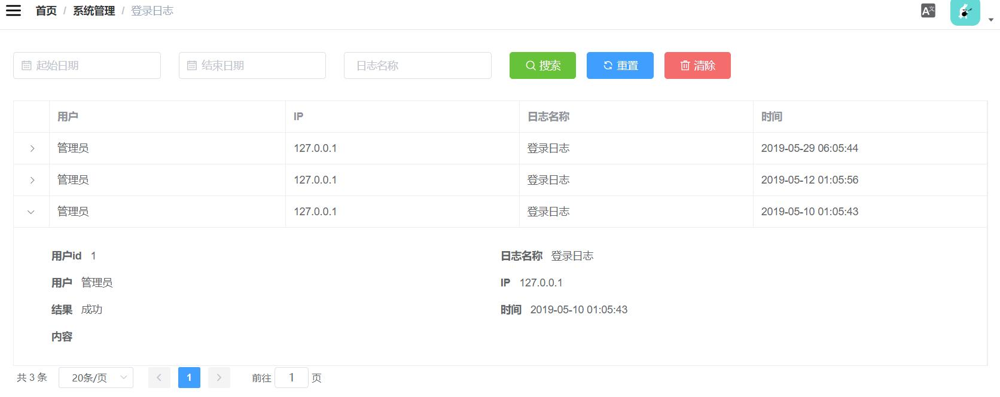

# 日志管理
日志管理包括两方面：
一个是后台用户登录日志的查看,
一个是业务日志,即用户操作日志。


## 登录日志
用户登录系统和退出系统的时候会调用LogTaskFactory记录相关日志，并在“登录日志”页面进行展示。



## 业务操作日志

系统提供了通过注解的形式可以方便的添加业务操作日志，比如记录修改系统参数的操作日志，可以通过如下方式：

在CfgController的编辑参数增加@BussinessLog注解：

```java
    @RequestMapping(method = RequestMethod.POST)
    @BussinessLog(value = "编辑参数", key = "cfgName",dict= CfgDict.class)   
    public Object save(@ModelAttribute @Valid Cfg cfg){
        if(cfg.getId()!=null){
            Cfg old = cfgService.get(cfg.getId());
            LogObjectHolder.me().set(old);
            old.setCfgName(cfg.getCfgName());
            old.setCfgValue(cfg.getCfgValue());
            old.setCfgDesc(cfg.getCfgDesc());
            cfgService.saveOrUpdate(old);
        }else {
            cfgService.saveOrUpdate(cfg);
        }
        return Rets.success();
    }
```
- 后台通过LogAop来保存用户操作日志。
- 在LogAop中也提供了获取变更前后的数据变化的功能。
- 通过LogObjectHolder类将变更前的数据临时存起来，在LogAop中拿出来和新数据进行对比。
- 如果不需要记录详细变更的内容，可以不设置，也就不会记录详细的变化内容了。

具体的实现逻辑感兴趣的同学可以自行通过注解类：BussinessLog进行跟踪查看。
